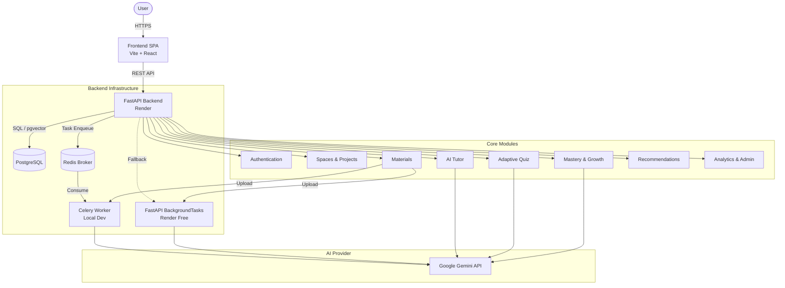

# AI Study Companion

## Overview
AI Study Companion is an AI-powered learning workspace designed to help users understand, practice, measure, and continuously improve a skill or area of knowledge. Unlike a simple chatbot, it operates as a persistent, contextual, and measurable learning companion. It uses advanced RAG (Retrieval-Augmented Generation) combined with an adaptive assessment engine to provide a structured educational journey.

## Product Goal
The primary goal is to provide a complete learning loop where users can define learning goals via Projects, upload PDF study materials, learn interactively with a grounded AI Tutor, and track their concept mastery through adaptive quizzes and growth analytics. 

## Core Learning Loop
The system supports the following continuous learning loop:

Create Space 
→ Create Project 
→ Upload Material 
→ Process Material (Extract & Embed) 
→ AI Tutor (Grounded Q&A) 
→ Adaptive Quiz (MCQ & Open-ended) 
→ Assessment Evaluation 
→ Concept Mastery Update 
→ Growth Analysis 
→ Personalized Recommendation 
→ Continue Learning

## Key Features
- **Authentication & Authorization:** Secure JWT-based access with strict multi-tenant isolation.
- **Spaces & Projects:** Hierarchical organization of learning goals.
- **PDF Materials & Document Processing:** Automated text extraction, semantic chunking, and embedding generation using Gemini.
- **AI Tutor with Grounded Citations:** A conversational AI that strictly cites specific pages from uploaded PDFs and gracefully refuses to answer unsupported questions to prevent hallucinations.
- **Adaptive Quiz Engine:** Dynamically generates multiple-choice and open-ended questions targeting the user's weakest concepts.
- **Concept Mastery & Growth Analysis:** Tracks estimated mastery (0-100%) per concept and classifies trends over time (Improving, Stable, Requiring Attention).
- **Actionable Recommendations:** AI-driven suggestions on what the learner should study next based on assessment history.
- **Persistent Learning Context:** Maintains a living memory of the user's strengths, weaknesses, and preferences across sessions.
- **Analytics & Admin Dashboard:** Project-level and global learning analytics, alongside an operational dashboard for administrators to monitor system health and AI usage.
- **AI Observability:** Comprehensive telemetry tracking AI model usage, tokens, latency, and success/failure rates.

## Architecture

The system follows a modern decoupled full-stack architecture:

**Frontend (Vite/React)** → **FastAPI API** → **Business Logic Layer** → **PostgreSQL / pgvector** (Data & Knowledge) 

Asynchronous operations are managed by **Redis & Celery** (or **FastAPI BackgroundTasks** on Render Free), and intelligent operations are routed to the **Gemini AI API**.

## Architecture Diagram



## Technology Stack
- **Frontend:** React, TypeScript, Vite, TailwindCSS, React Query, React Router, Lucide React (Icons).
- **Backend:** Python 3.11+, FastAPI, SQLAlchemy (ORM), Pydantic, Alembic (Migrations).
- **Database:** PostgreSQL with `pgvector` extension for vector similarity search.
- **Background Processing:** Celery + Redis (Local), FastAPI BackgroundTasks (Render Free Production).
- **AI Provider:** Google Gemini API (`gemini-2.5-flash` and `gemini-embedding-2`).
- **Document Processing:** PyMuPDF for PDF text and structure extraction.
- **Deployment:** Vercel (Frontend), Render (Backend, DB, Redis).

## Project Structure
```text
.
├── backend/
│   ├── alembic/              # Database migrations
│   ├── app/
│   │   ├── api/              # API Router configuration
│   │   ├── core/             # Base configurations and storage
│   │   ├── modules/          # Domain-driven feature modules (auth, tutor, etc.)
│   │   ├── config.py         # Environment configuration
│   │   ├── database.py       # DB connection
│   │   └── main.py           # FastAPI application entrypoint
│   ├── tests/                # Comprehensive test suite
│   └── requirements.txt
├── docs/                     # Architecture, Evaluation, Prompts, etc.
├── frontend/
│   ├── src/
│   │   ├── api/              # API Client (axios)
│   │   ├── components/       # Reusable React components
│   │   ├── pages/            # Top-level route components
│   │   └── App.tsx           # React Router setup
│   ├── package.json
│   ├── tailwind.config.js
│   └── vercel.json           # Vercel SPA routing rules
├── .env.example
└── docker-compose.yml
```

## Database
The PostgreSQL database uses the following core entities:
- **Users**: Core authentication.
- **Spaces & Projects**: Organizational hierarchy (`projects` belong to `spaces`).
- **Materials**: Uploaded PDFs (`material_pages`, `material_chunks` with `pgvector` embeddings).
- **Tutor**: `tutor_conversations` and `tutor_messages`.
- **Assessment**: `quizzes`, `quiz_questions`, `quiz_attempts`, `quiz_answers`.
- **Mastery**: `concepts`, `concept_mastery`, `growth_classifications`.
- **Telemetry & Events**: `learning_events`, `ai_telemetry_logs`, `background_jobs`.

## AI Architecture
The application treats AI as an engineering system rather than a simple API wrapper:
- **Embeddings & Retrieval:** `gemini-embedding-2` creates 1536-dimensional vectors for document chunks, stored in `pgvector`.
- **Structured Generation:** Uses Gemini's `json_object` response format validated against strictly typed Pydantic schemas.
- **Grounded Tutor:** Uses cosine similarity retrieval. Strict thresholding ensures the Tutor refuses to answer questions if no relevant evidence is found (`GROUNDED_REFUSAL_MESSAGE`). Citations are validated against actual retrieved page numbers to prevent hallucination.
- **Adaptive Quiz Generation:** Identifies weak concepts and injects relevant chunks into the prompt context to generate grounded multiple-choice and open-ended questions.
- **Open-Ended Evaluation:** An LLM-as-a-judge grades open-ended answers, extracting identified concepts and missing concepts to update mastery arrays.
- **Persistent Learner Context:** A dedicated service stores and retrieves user weaknesses and preferences to seamlessly guide prompt generation.

## RAG Pipeline
The Retrieval-Augmented Generation pipeline follows these steps:
1. **Extraction:** PyMuPDF extracts text per page.
2. **Chunking:** Text is split with overlap (`CHUNK_SIZE=800`, `CHUNK_OVERLAP=100`).
3. **Embedding:** Vectors are generated and persisted in `pgvector`.
4. **Retrieval:** Cosine similarity retrieves the top chunks constrained strictly to the active `project_id`.
5. **Grounded Prompt:** Chunks are compiled alongside persistent Learner Context and recent conversation history.
6. **Citation Validation:** Output citations are stripped if they do not match the explicitly retrieved page numbers.

## Background Processing
Due to long-running AI operations (embedding entire PDFs), material processing is asynchronous.

**Local Environment:**
- Relies on **Celery** connected to **Redis**. 
- Provides robustness, queue management, and exponential backoff retries.

**Render Free Production Environment:**
- Render's Free tier does not easily support a separate background worker service. 
- Controlled by `USE_CELERY=False`, the application gracefully falls back to `FastAPI BackgroundTasks`, executing the exact same synchronous processing pipeline within the Uvicorn web thread.

## Security
- **Authentication:** Standard OAuth2 Password Bearer with JWT tokens.
- **Authorization & Data Isolation:** All API routes strictly enforce ownership queries (e.g., `Project.user_id == current_user.id`). Vector searches are completely isolated by `project_id`.
- **Input Validation:** Pydantic schemas validate all incoming API payloads and outgoing AI structured generation.
- **Prompt Safety:** Learner context and user inputs are fenced in XML-like tags to mitigate prompt injection.
- **Secrets:** Managed via `.env` and `pydantic-settings`.
- **CORS:** Explicitly restricted to trusted origins (localhost, Vercel).

## AI Observability
The `ai_telemetry_logs` table records every LLM interaction, capturing:
- `feature` (e.g., tutor, quiz_generation)
- `model` (e.g., gemini-2.5-flash)
- `latency_ms`
- `prompt_tokens` & `completion_tokens`
- `status` (success/failure)
- Workflow context (e.g., how many chunks were retrieved)

*Note: USD cost tracking is not currently aggregated, but can be derived from token usage.*

## Testing
The application features a robust test suite (`pytest`) comprising 116 passing tests covering all 10 project phases. 
Tests validate Auth, isolated Project/Material management, RAG retrieval boundaries, Tutor logic, Background Job retries, and comprehensive Assessment workflows.

## Local Setup

**1. Database (PostgreSQL + pgvector) and Redis**
```bash
docker-compose up -d
```

**2. Backend**
```bash
cd backend
python -m venv .venv
# Activate venv: `source .venv/bin/activate` or `.venv\Scripts\activate` on Windows
pip install -r requirements.txt
alembic upgrade head
uvicorn app.main:app --host 127.0.0.1 --port 8000 --reload
```

**3. Celery Worker (Local)**
```bash
cd backend
celery -A app.celery_app.celery_app worker --loglevel=info
```

**4. Frontend**
```bash
cd frontend
npm install
npm run dev
```

## Environment Variables
**(Do not use these values in production. Use secure random strings.)**
See `.env.example` for details.
- `ENVIRONMENT`
- `DEBUG`
- `SECRET_KEY`
- `ALGORITHM`
- `ACCESS_TOKEN_EXPIRE_MINUTES`
- `POSTGRES_USER`, `POSTGRES_PASSWORD`, `POSTGRES_SERVER`, `POSTGRES_DB`, `POSTGRES_PORT`
- `DATABASE_URL`
- `USE_CELERY`
- `REDIS_URL`, `CELERY_BROKER_URL`, `CELERY_RESULT_BACKEND`
- `GEMINI_API_KEY`, `GEMINI_MODEL`, `GEMINI_EMBEDDING_MODEL`
- `CORS_ORIGINS`
- `VITE_API_BASE_URL` (Frontend)

## Deployment
- **Frontend (Vercel):** Deployed as a standard Vite SPA. SPA routing is managed via `vercel.json` rewrites. `VITE_API_BASE_URL` is set to the Render backend URL.
- **Backend (Render Web Service):** 
  - Uses `python 3.11`. 
  - Start command overridden to safely apply migrations before boot: `alembic upgrade head && uvicorn app.main:app --host 0.0.0.0 --port $PORT`
  - `USE_CELERY` is explicitly set to `False` to utilize the BackgroundTasks fallback.
- **Database (Render PostgreSQL):** Standard PostgreSQL with `pgvector` enabled.
- **Redis:** Used for Celery locally; not required on Render Free due to the `USE_CELERY=False` fallback.

## Production Limitations (Render Free)
The deployed production environment utilizes Render's Free tier, introducing explicit limitations:
- **No Dedicated Celery Worker:** PDF processing runs in the web server process via FastAPI BackgroundTasks.
- **Memory Constraints:** Complex PDFs could spike memory above the 512MB limit, causing an application restart.
- **Inactivity Sleep:** The service sleeps after 15 minutes of inactivity. If a background processing job is running when the server sleeps, it will be interrupted without auto-retry mechanisms.
- **Quota Limits:** Extensive interactions may hit Gemini API rate limits.

## AI Usage Documentation

### AI used to BUILD the product
- **Antigravity (Google Deepmind):** Used as an autonomous coding agent to implement complex backend logic, refactor frontend architecture, diagnose CORS issues, and establish Render/Vercel configuration pipelines.
- **Coding Assistants:** standard inline completions were used during manual oversight and architectural planning.

### AI used BY the final product
- **Gemini Text Generation (`gemini-2.5-flash`):** Powers the Grounded AI Tutor, Quiz Generator, Open-Ended Assessment Evaluator, Concept Extractor, and Recommendation Engine.
- **Gemini Embeddings (`gemini-embedding-2`):** Converts semantic PDF text chunks into 1536-dimensional vectors for similarity retrieval.
